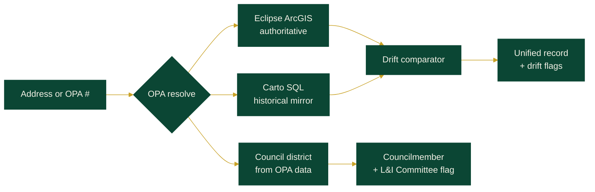

<div align="center">

# 4PHILLY

### Philadelphia property record — unified, live, drift-aware

[](https://thumpersecure.github.io/4philly/)
[](#license)
[](#install-as-a-pwa)
[](#tech)
[](#data-sources)

**[Open the app](https://thumpersecure.github.io/4philly/)**  ·  [Report a bug](../../issues)  ·  [Coverage gaps](#what-this-cant-tell-you)

</div>

-----

## What this is

One unified Philadelphia property record. Type any address or OPA number — get business licenses, open violations, violation history, 311 complaints, permits, building certifications, and your **City Council district with councilmember contact info**, all pulled live from the city's own data.

Every data point is pulled from **Eclipse** (the authoritative L&I backend behind `li.phila.gov`) *and* **Carto** (the historical open-data mirror at `phl.carto.com`). When they disagree, 4PHILLY flags it. Eclipse always wins.

> [!NOTE]
> 4PHILLY runs entirely in your browser. No server. No analytics. No account. Your lookups don't leave your device except to hit the city's public APIs.

-----

## Try it

Drop any of these into the lookup bar at the top of the app:

|Input             |What it pulls               |
|------------------|----------------------------|
|`315 N 12th St`   |address-based lookup        |
|`1900 Market St`  |high-rise example           |
|`The Sterling`    |partial-name match          |
|OPA account number|OPA-anchored (most reliable)|

> [!TIP]
> OPA account numbers beat address strings for reliability — but they aren't permanent. Parcels can be re-numbered on splits, merges, or condo conversions. 4PHILLY stores coordinates from each successful lookup so it can **automatically resolve re-numbered parcels** via the DOR Parcel layer and coordinate proximity, then redirect you to the new OPA. You can also verify any property on [Atlas](https://atlas.phila.gov/).

-----

## Features

|                       |What it does                                                                                 |
|-----------------------|---------------------------------------------------------------------------------------------|
|**Live data**          |Eclipse ArcGIS feature services + Carto SQL API, pulled at lookup time                       |
|**Drift detection**    |Side-by-side compare; divergent rows highlighted red                                         |
|**Status decoding**    |`OPEN`, `COMPLIED`, `CLOSED`, `CLOSEDCASE`, `RESOLVE` — only **COMPLIED** is real compliance[^1]|
|**Council resolution** |District councilmember name, email, phone, committee assignments, L&I Committee flagging     |
|**OPA fallback**       |If a saved OPA goes stale, resolves via DOR Parcel geometry, coordinate proximity, or address |
|**Atlas verification** |Direct link to the city's Atlas tool for independent confirmation                            |
|**OPA-anchored**       |Identity bound to OPA account, with lat/lng fallback for re-numbered parcels                 |
|**PWA**                |Installable on iOS and Android; works on desktop; offline shell                              |
|**No backend**         |Static site. Auditable. Forkable. Nothing between you and the city's APIs.                   |

[^1]: `CLOSEDCASE` in particular is ambiguous — a case can close without compliance being achieved. The `COMPLIED` status is the only one that means the underlying condition was resolved on inspection.

-----

## How it works



Eclipse is what L&I inspectors actually use. Carto is what gets published to OpenDataPhilly. They drift. License expirations, violation status changes, and new complaints appear in Eclipse before — sometimes *long* before — Carto catches up.

4PHILLY shows you both.

### OPA re-number fallback

OPA account numbers are not static. Parcels get split, merged, and re-numbered. When a saved or bookmarked OPA returns empty, 4PHILLY runs a three-tier fallback:

1. **DOR Parcel geometry** — point-in-polygon query against the city's parcel boundary layer using stored coordinates
2. **OPA coordinate proximity** — finds the nearest parcel within ~40m of the last known lat/lng
3. **Address re-resolution** — falls back to the stored address string against the OPA location field

On success, the app redirects to the new OPA, updates saved bookmarks, and shows a banner with an [Atlas](https://atlas.phila.gov/) verification link.

-----

## Tabs

The app surfaces six views per property:

- **Inspect** — business & trade licenses, open violations, violation history, 311 complaints (last 24 months)
- **Drift** — Eclipse vs. Carto side-by-side, divergent rows highlighted
- **Brief** — plain-language read of the property record with legal citations
- **Records** — permits and building certifications
- **Limits** — what the data can't tell you, with source citations
- **Council** — district councilmember contact info, committee assignments, L&I Committee flagging for properties with violations or expired licenses

-----

## Council district resolution

The Council tab resolves the property's OPA `council_district_2024` field to the current councilmember and displays:

- Councilmember name, email, phone, office location
- Tappable email/phone links (mobile-optimized)
- Committee assignments with chair roles highlighted
- **L&I Committee flag** — when the property has open violations or an expired rental license, surfaces the L&I Committee Chair (currently Michael Driscoll, District 6) with direct contact info for escalation
- All 7 at-large council members with contact info

Roster data sourced from [phlcouncil.com](https://phlcouncil.com/) standing committees page (embedded 2026-05-20).

A standalone Node.js module is also available at [`council/`](council/) for backend/agent use with point-in-polygon district resolution from coordinates.

-----

## What this can't tell you

> [!WARNING]
> Public data has limits. Some are city policy, some are technical, some are because the data simply doesn't exist in machine-readable form. **Verify any claim before relying on it.**

|Gap                     |Why                                                    |
|------------------------|-------------------------------------------------------|
|Inspector identity      |Not published in public feeds                          |
|Inspector notes         |Internal correspondence only                           |
|311 complainant identity|Protected by policy                                    |
|Re-inspection occurrence|Status updates don't require a physical visit to record|
|Pre-archive violations  |Carto archive coverage varies; Eclipse retention varies|
|Sealed cases            |Excluded from public feeds entirely                    |

See the **Limits** tab inside the app for the full list with source citations.

-----

## Install as a PWA

<details>
<summary><b>iOS (Safari)</b></summary>

1. Open <https://thumpersecure.github.io/4philly/> in Safari
1. Tap the Share button
1. Tap **Add to Home Screen**
1. Confirm — 4PHILLY now lives on your home screen like a native app

</details>

<details>
<summary><b>Android (Chrome)</b></summary>

1. Open the site in Chrome
1. Tap the three-dot menu
1. Tap **Install app** (or **Add to Home screen**)
1. Confirm

</details>

<details>
<summary><b>Desktop (Chrome / Edge / Brave)</b></summary>

1. Open the site
1. Click the install icon at the right edge of the address bar
1. Or: menu → **Install 4PHILLY**

</details>

-----

## Project structure

<details>
<summary>Click to expand</summary>

```text
4philly/
├── index.html              # single-file PWA — all HTML, CSS, JS inline
├── manifest.json           # PWA manifest
├── sw.js                   # service worker (offline shell)
├── og-image.png            # social card
├── icon.svg                # app icon
├── 404.html                # GitHub Pages fallback
├── council/                # Node.js council district resolution module
│   ├── src/
│   │   ├── index.js        # main orchestrator — resolveCouncilMember()
│   │   ├── opa-client.js   # OPA Property API client
│   │   ├── geo.js          # point-in-polygon (ray-casting)
│   │   ├── district-resolver.js
│   │   ├── councilmember-lookup.js
│   │   ├── committee-flag.js
│   │   ├── cache.js        # LRU cache with TTL
│   │   └── format.js       # text + HTML output formatters
│   ├── data/
│   │   ├── districts.geojson      # 10 geographic district boundaries
│   │   ├── councilmembers.json    # full 17-member roster
│   │   └── committees.json        # L&I Committee chair config
│   └── tests/
│       └── council.test.js        # 12 unit tests (geo + cache)
├── tests/
│   └── opa-licenses.integration.test.mjs
├── tools/
│   ├── generate-property-pages.mjs    # builds the static /p/ snapshot pages — see tools/README.md
│   └── README.md                      # exact run instructions for the generator
├── p/                      # generated property-record snapshot pages (committed output)
└── README.md
```

</details>

-----

## Tech

<div align="center">


</div>

No frameworks. No build step. Vanilla JS, `fetch`, and the city's public APIs. The entire frontend is a single `index.html` file with inline CSS and JS.

The `council/` directory contains a standalone Node.js ESM module for server-side or agent use — same data, point-in-polygon resolution from coordinates instead of OPA field lookup.

-----

## GitHub Pages deployment

- Pages deploy is automated with `.github/workflows/deploy-pages.yml`.
- On `main` pushes, the workflow publishes from the repository root (`.`).
- For branch layouts that publish from `/docs`, run the workflow manually and choose `publish_source=docs`.

-----

## Data sources

- **Eclipse ArcGIS** — `services.arcgis.com/fLeGjb7u4uXqeF9q` — authoritative for current state (violations, licenses, permits, building certs)
- **Carto SQL API** — `phl.carto.com` — historical mirror (can lag Eclipse), also hosts 311 complaints (`public_cases_fc`)
- **OPA assessment layer** — property identity anchor (parcel number, address, owner, coordinates, council district)
- **DOR Parcel layer** — parcel polygon boundaries for re-numbered OPA resolution
- **phlcouncil.com** — council roster, committee assignments, leadership (embedded snapshot)

-----

## Status semantics

A short field guide to the L&I status codes you'll see:

<dl>
  <dt><b><code>OPEN</code></b></dt>
  <dd>Violation has been issued. No resolution yet.</dd>

  <dt><b><code>COMPLIED</code></b></dt>
  <dd>Inspector verified the condition was resolved. This is the only status that means what it sounds like.</dd>

  <dt><b><code>CLOSED</code> / <code>CLOSEDCASE</code></b></dt>
  <dd>Case is administratively closed. Could mean resolved, could mean dropped, could mean reassigned. Not confirmed compliance.</dd>

  <dt><b><code>RESOLVE</code></b></dt>
  <dd>Resolved via appeal. Compliance not confirmed by inspection.</dd>

  <dt><b><code>ERROR</code></b></dt>
  <dd>Data-entry anomaly. Not a real enforcement outcome.</dd>
</dl>

-----

## Roadmap

- [x] Eclipse + Carto unified lookup
- [x] Drift detection (license + violation)
- [x] PWA install (iOS, Android, desktop)
- [x] 311 complaints (24-month window)
- [x] OPA-anchored identity
- [x] Permits and building certifications
- [x] Plain-language brief with legal citations
- [x] Council district resolution + councilmember contact
- [x] L&I Committee flagging for violations/licensing
- [x] OPA re-number fallback (DOR Parcel + coordinate + address)
- [x] Atlas verification links
- [ ] Permit timeline view
- [ ] Multi-property watchlist
- [ ] CSV / JSON export
- [ ] Diff alerts (subscribe to a property)
- [ ] Print-ready brief (one-page PDF per property)
- [x] Real GIS boundaries for council districts (official 2024 districts in council module)

-----

## Contributing

Found drift the comparator missed? A status code that should decode differently? An edge case where Eclipse and Carto give the same answer but neither is correct? Council data out of date?

Open an issue with the **OPA number** and what you saw. PRs welcome.

-----

## License

MIT — see [`LICENSE`](LICENSE).

-----

## Credits

Built by [**@thumpersecure**](https://github.com/thumpersecure).

Civic data is public. This tool makes it legible.

<div align="center">

**[Open the app](https://thumpersecure.github.io/4philly/)**

<sub>4PHILLY is an independent civic tool. Not affiliated with the City of Philadelphia, L&I, OPA, or City Council.</sub>

</div>
