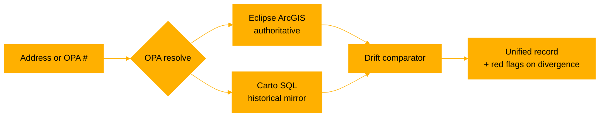

<div align="center">

# 4PHILLY

### Philadelphia property record — unified, live, drift-aware

[](https://thumpersecure.github.io/4PHILLY/)
[](#license)
[](#install-as-a-pwa)
[](#tech)
[](#data-sources)

**[→ Open the app](https://thumpersecure.github.io/4PHILLY/)**  ·  [Report a bug](../../issues)  ·  [Coverage gaps](#what-this-cant-tell-you)

</div>

-----

## What this is

One unified Philadelphia property record. Type any address or OPA number — get business licenses, open violations, violation history, and 311 complaints, all pulled live from the city’s own data.

The trick: every data point is pulled from **Eclipse** (the authoritative L&I backend behind `li.phila.gov`) *and* **Carto** (the historical open-data mirror at `phl.carto.com`). When they disagree, 4PHILLY flags it. Eclipse always wins.

> [!NOTE]
> 4PHILLY runs entirely in your browser. No server. No analytics. No account. Your lookups don’t leave your device except to hit the city’s public APIs.

-----

## Try it

Drop any of these into the lookup bar at the top of the app:

|Input             |What it pulls               |
|------------------|----------------------------|
|`315 N 12th St`   |address-based lookup        |
|`1900 Market St`  |high-rise example           |
|`The Sterling`    |partial-name match          |
|OPA account number|OPA-anchored (most reliable)|


> [!TIP]
> OPA account numbers beat address strings every time. The city normalizes addresses differently across systems — Eclipse, Carto, and OPA itself can disagree on the same building. The OPA number doesn’t drift.

-----

## Features

|                   |What it does                                                                                 |
|-------------------|---------------------------------------------------------------------------------------------|
|**Live data**      |Eclipse ArcGIS feature services + Carto SQL API, pulled at lookup time                       |
|**Drift detection**|Side-by-side compare; divergent rows highlighted red                                         |
|**Status decoding**|`OPEN`, `IN COMPLIANCE`, `COMPLIED`, `CASE CLOSED` — only **COMPLIED** is real compliance[^1]|
|**OPA-anchored**   |Identity bound to OPA account, not fuzzy address matching                                    |
|**PWA**            |Installable on iOS and Android; works on desktop; offline shell                              |
|**No backend**     |Static site. Auditable. Forkable. Nothing between you and the city’s APIs.                   |

[^1]: `CASE CLOSED` in particular is ambiguous — a case can close without compliance being achieved. The `COMPLIED` status is the only one that means the underlying condition was resolved on inspection.

-----

## How it works



Eclipse is what L&I inspectors actually use. Carto is what gets published to OpenDataPhilly. They drift. License expirations, violation status changes, and new complaints appear in Eclipse before — sometimes *long* before — Carto catches up.

4PHILLY shows you both.

-----

## Tabs

The app surfaces five views per property:

- **Inspect** — business & trade licenses, open violations, violation history, 311 complaints (last 24 months)
- **Drift** — Eclipse vs. Carto side-by-side, divergent rows highlighted
- **Brief** — coverage gaps summary
- **Records** — permits and building certifications
- **Limits** — what the data can’t tell you, with citations

-----

## What this can’t tell you

> [!WARNING]
> Public data has limits. Some are city policy, some are technical, some are because the data simply doesn’t exist in machine-readable form. **Verify any claim before relying on it.**

|Gap                     |Why                                                    |
|------------------------|-------------------------------------------------------|
|Inspector identity      |Not published in public feeds                          |
|Inspector notes         |Internal correspondence only                           |
|311 complainant identity|Protected by policy                                    |
|Re-inspection occurrence|Status updates don’t require a physical visit to record|
|Pre-archive violations  |Carto archive coverage varies; Eclipse retention varies|
|Sealed cases            |Excluded from public feeds entirely                    |

See the **Limits** tab inside the app for the full list with source citations.

-----

## Install as a PWA

<details>
<summary><b>iOS (Safari)</b></summary>

1. Open <https://thumpersecure.github.io/4PHILLY/> in Safari
1. Tap the Share button
1. Tap **Add to Home Screen**
1. Confirm — 4PHILLY now lives on your home screen like a native app

</details>

<details>
<summary><b>Android (Chrome)</b></summary>

1. Open the site in Chrome
1. Tap the three-dot menu
1. Tap **Install app** (or **Add to Home screen**)
1. Confirm

</details>

<details>
<summary><b>Desktop (Chrome / Edge / Brave)</b></summary>

1. Open the site
1. Click the install icon at the right edge of the address bar
1. Or: menu → **Install 4PHILLY**

</details>

-----

## Project structure

<details>
<summary>Click to expand</summary>

```text
4PHILLY/
├── index.html              # entry point
├── manifest.webmanifest    # PWA manifest
├── sw.js                   # service worker
├── og-image.png            # social card
├── assets/
│   ├── css/                # black + amber theme
│   ├── js/
│   │   ├── eclipse.js      # ArcGIS feature service client
│   │   ├── carto.js        # Carto SQL client
│   │   ├── drift.js        # comparison engine
│   │   ├── render.js       # tab views
│   │   └── opa.js          # OPA resolver
│   └── icons/              # PWA icons (multiple sizes)
└── README.md               # you are here
```

</details>

-----

## Tech

<div align="center">


</div>

No frameworks. No build step. Vanilla JS, `fetch`, and the two city APIs.

-----

## Data sources

- **Eclipse ArcGIS** — `services.arcgis.com/fLeGjb7u4uXqeF9q` — authoritative for current state
- **Carto SQL API** — `phl.carto.com` — historical mirror, can lag Eclipse
- **OPA assessment layer** — anchor for property identity

-----

## Status semantics

A short field guide to the L&I status codes you’ll see:

<dl>
  <dt><b><code>OPEN</code></b></dt>
  <dd>Violation has been issued. No resolution yet.</dd>

  <dt><b><code>IN COMPLIANCE</code></b></dt>
  <dd>Owner has claimed compliance. <em>Not</em> verified by inspection.</dd>

  <dt><b><code>COMPLIED</code></b></dt>
  <dd>Inspector verified the condition was resolved. This is the only status that means what it sounds like.</dd>

  <dt><b><code>CASE CLOSED</code></b></dt>
  <dd>Case is administratively closed. Could mean resolved, could mean dropped, could mean reassigned. Look at the surrounding history.</dd>
</dl>

-----

## Roadmap

- [x] Eclipse + Carto unified lookup
- [x] Drift detection
- [x] PWA install
- [x] 311 complaints (24-month window)
- [x] OPA-anchored identity
- [ ] Permit timeline view
- [ ] Multi-property watchlist
- [ ] CSV / JSON export
- [ ] Diff alerts (subscribe to a property)
- [ ] Print-ready brief (one-page PDF per property)

-----

## Contributing

Found drift the comparator missed? A status code that should decode differently? An edge case where Eclipse and Carto give the same answer but neither is correct?

Open an issue with the **OPA number** and what you saw. PRs welcome.

-----

## License

MIT — see [`LICENSE`](LICENSE).

-----

## Credits

Built by [**@thumpersecure**](https://github.com/thumpersecure).

Civic data is public. This tool makes it legible.

<div align="center">

**[→ Open the app](https://thumpersecure.github.io/4PHILLY/)**

<sub>4PHILLY is an independent civic tool. Not affiliated with the City of Philadelphia, L&I, or OPA.</sub>

</div>
